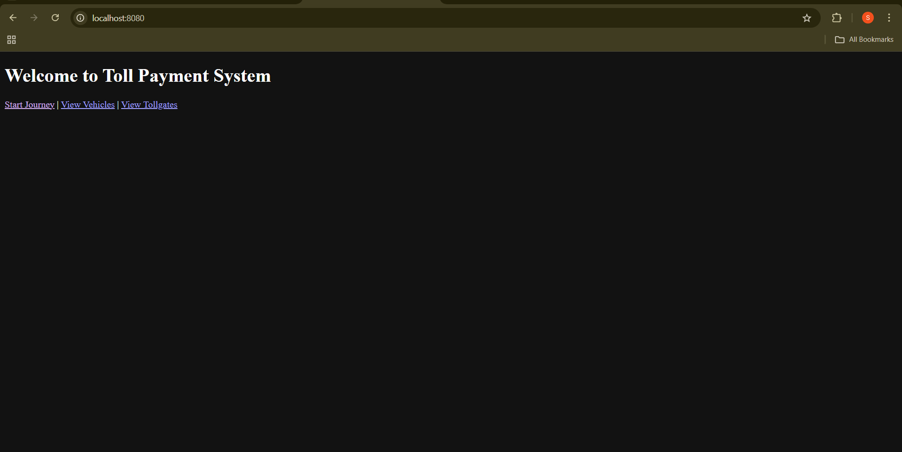
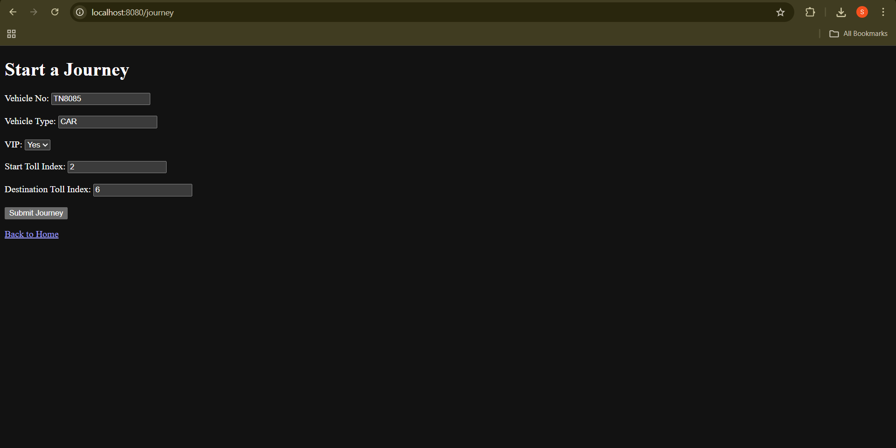
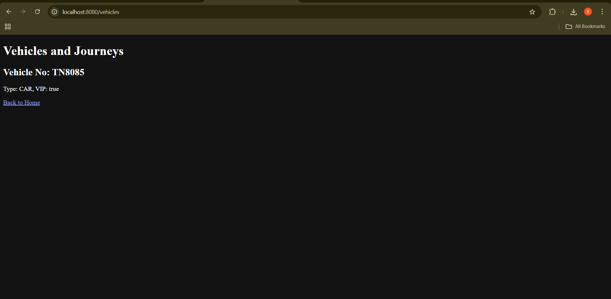
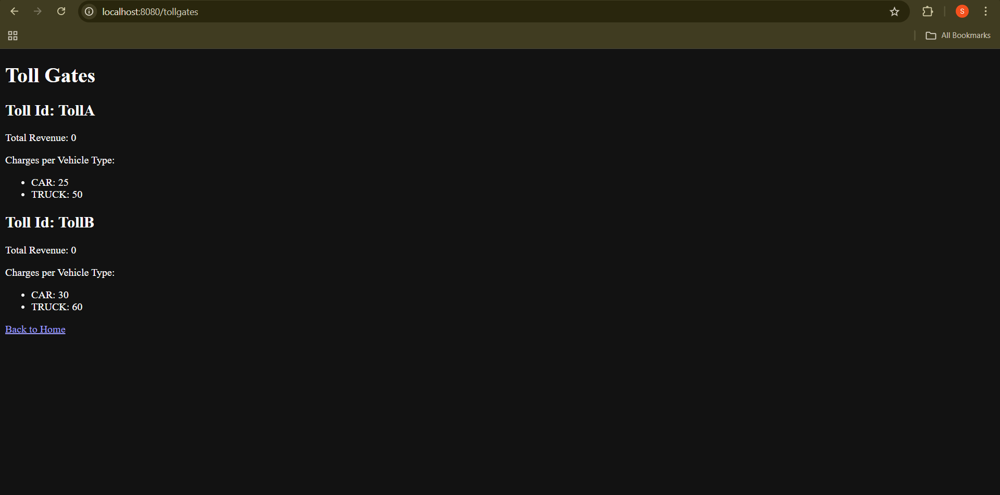
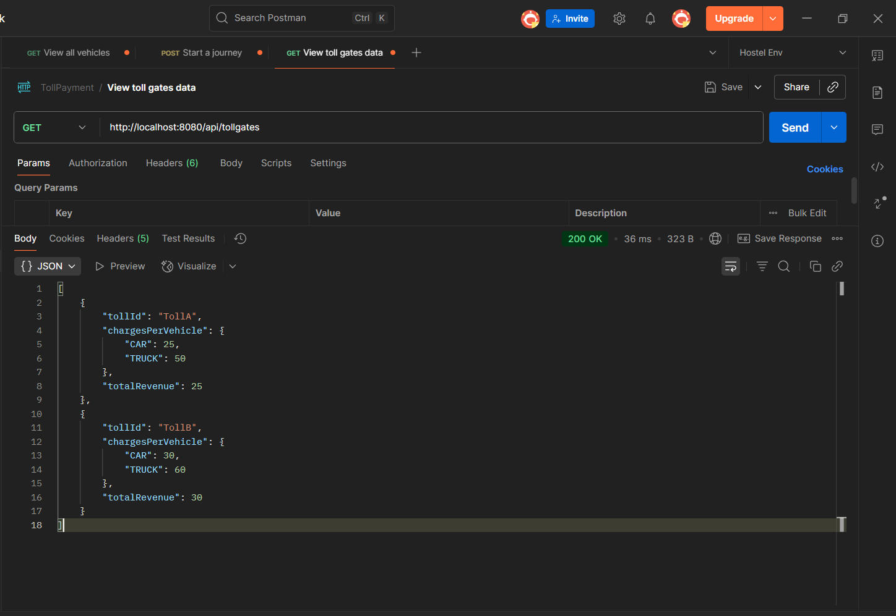
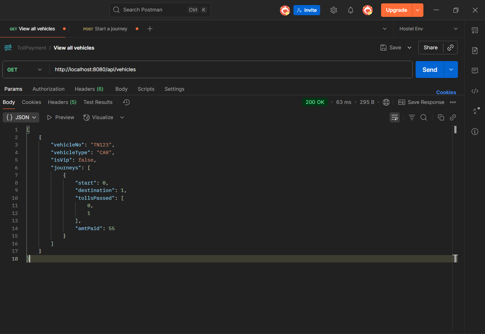
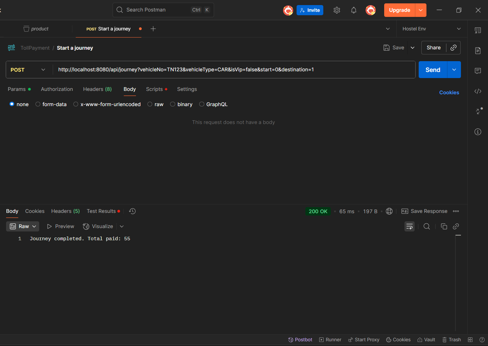

 # Toll Payment Processing System

## Overview
This project is a Spring Boot application that simulates toll gate payment processing for vehicles on a highway. It includes RESTful APIs and a simple Thymeleaf-based web UI. The system manages toll gates, processes vehicle journeys with VIP discounts, and tracks payments and toll revenues.

It demonstrates backend development with Spring Boot, MySQL persistence, and UI templating with Thymeleaf.

## Features
- Manage toll gates with custom charges per vehicle type  
- Process vehicle journeys including VIP discount application  
- Track journeys and total toll paid per vehicle  
- REST APIs for journey processing and data retrieval  
- Simple frontend UI using Thymeleaf templates  
- MySQL persistence using Spring Data JPA  

## Installation and Running
1. Clone or download the repository.  
2. Set up MySQL database `tolldb` and update credentials in `application.properties`.  
3. Build the project using Maven:
mvn clean install

4. Run the application:
mvn spring-boot:run

5. Open your browser and visit:
http://localhost:8080/

## API Endpoints

| Method | Endpoint           | Description                          |
|--------|--------------------|------------------------------------|
| POST   | `/api/journey`     | Start a vehicle journey (query params) |
| GET    | `/api/vehicles`    | Get all vehicles and their journeys |
| GET    | `/api/tollgates`   | Get toll gate details and revenue   |

### Example: Start a Journey  

POST http://localhost:8080/api/journey?vehicleNo=TN123&vehicleType=CAR&isVip=false&start=0&destination=1

## Web UI

- Home page with navigation menu  
- Form to submit new journeys with vehicle details  
- List of vehicles and their journeys  
- Toll gate information page displaying revenues and charges  

## Project Structure

project-root/
└── src/
├── main/
│ ├── java/com/toll/api/
│ │ ├── controller/
│ │ ├── model/ 
│ │ └── service/ 
│ └── resources/
│ ├── templates/ 
│ └── application.properties
└── pom.xml 

## Screenshots

### Home Page 
  

### Journey Form  

### Vehicles List  

### Toll Gates Info  

###Api Testings

 
 
 

## Troubleshooting
- Add `allowPublicKeyRetrieval=true` to MySQL JDBC URL if you encounter public key retrieval errors.  
- Verify database connection and credentials.  
- Ensure Thymeleaf templates exist in `src/main/resources/templates/`.  
- Use Postman or curl to test APIs independently for debugging.  

## Future Improvements
- Add user authentication and authorization  
- Implement advanced routing and discount rules  
- Enhance UI with modern frontend framework  
- Add detailed reports and analytics  

